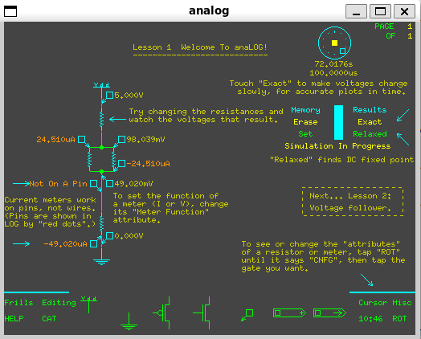

# Chipmunk Tools



This repository contains the Chipmunk system tools, originally developed by Dave Gillespie, John Lazzaro, and others.  Although most of the Carvrland Physics of Comptation Lab chips were designed using these tools, they are no longer useful for chip design. 

However, **analog** in particular is great for getting intuiion by playing. The simulation runs like a circuit on a bench. As soon as the circuit is valid, it starts simulating.

## Quick Start

### For Ubuntu/WSL2 Users

1. **Install dependencies:**
   ```bash
   sudo apt-get install gcc make libx11-dev xfonts-base xfonts-75dpi xfonts-100dpi
   xset fp rehash
   ```

2. **Clone and build:**
   ```bash
   git clone https://github.com/sensorsINI/chipmunk.git
   cd chipmunk
   make build
   ```

3. **Run the simulator:**
   ```bash
   ./bin/analog
   ```
   The tutorial circuit (`lesson1.lgf`) will open automatically for first-time users.

4. **Get help:**
   ```bash
   ./bin/analog --help
   ```

**That's it!** See [Building and Installation](#building-and-installation) for detailed instructions and troubleshooting.

### Using Pre-built Binaries (Releases)

Pre-built binaries are available in [GitHub Releases](https://github.com/sensorsINI/chipmunk/releases). Download the release archive, extract it, and run:

```bash
./bin/analog
```

**Note:** Pre-built binaries are for Linux x86_64. For other platforms or to customize the build, see [Building and Installation](#building-and-installation).

## Version

- **This Repository Version**: 6.0.0
- **Base Chipmunk/LOG Version**: 5.66
- **SPICE Converter Version**: 1.0 Beta

See [CHANGELOG.md](CHANGELOG.md) for detailed version history and changes.

## Original Source

The original Chipmunk tools are distributed via GitHub Pages:
- **Official Website**: https://john-lazzaro.github.io/chipmunk/
- **Author Contact**: john [dot] lazzaro [at] gmail [dot] com

## License

This software is distributed under the GNU General Public License (GPL) version 1 or later. See the `COPYING` files in the `psys/src/` and `log/src/` directories for the full license text.

## About Chipmunk

The Chipmunk system is a collection of software tools for Unix systems and OS/2, including:

- **Log**: A schematic editor, analog and digital simulator, and netlist generator
- **Analog**: Analog circuit simulation tool
- **Diglog**: Digital circuit simulation tool
- **Loged**: Gate editor for creating custom gate icons
- **View, Until, Wol**: Additional CAD tools

## Modifications in This Repository

This repository includes the following modifications:

- **Wrapper Scripts**: Added wrapper scripts (`analog`, `diglog-wrapper`) that automatically set the `LOGLIB` environment variable to ensure proper configuration file discovery
- **Build Fixes**: Compiled and tested on modern Linux systems with X11

## Building and Installation

### Prerequisites

- ANSI C compiler (typically GCC)
- X11 (R4, R5, or R6)
- **X11 fonts: `xfonts-base`, `xfonts-75dpi`, `xfonts-100dpi`** (required - see Installation Steps)
  - These packages provide the `6x10` and `8x13` fonts that Chipmunk requires
  - Without these fonts, the program will fail with X11 font errors

### Installation Steps

1. **Install required X11 fonts** (required for Ubuntu/WSL2):
   ```bash
   sudo apt-get install xfonts-base xfonts-75dpi xfonts-100dpi
   xset fp rehash
   ```
   
   **Important**: The Chipmunk tools require the X11 fonts `6x10` and `8x13`. These fonts are provided by the packages above. Without them, you will see errors like:
   ```
   X Error of failed request: BadName (named color or font does not exist)
   Major opcode of failed request: 45 (X_OpenFont)
   ```

2. **Verify requirements** (optional but recommended):
   ```bash
   ./check_requirements.sh
   ```
   This script checks for fonts, X11 display, and other requirements.

3. **Build the tools**:
   ```bash
   make
   ```
   Or build manually:
   ```bash
   cd psys/src && make install
   cd ../../log/src && make install
   ```

4. **Run the analog simulator**:
   ```bash
   ./bin/analog
   ```

The wrapper scripts automatically configure the `LOGLIB` environment variable and load the appropriate configuration file (`analog.cnf` for analog mode).

## Configuration Files

Chipmunk uses `.cnf` (configuration) files to define gate libraries, device models, and simulation parameters. These files are located in the `log/lib/` directory.

### Default Configuration Files

- **`log/lib/analog.cnf`**: Default configuration for analog simulation mode (loaded automatically by `./bin/analog`)
- **`log/lib/diglog.cnf`**: Default configuration for digital simulation mode
- **`log/lib/genlog.cnf`**: General Log configuration
- **`log/lib/log.cnf`**: Base Log configuration

### Sample Configuration Files

- **`log/lib/mos_example.cnf`**: Example MOS process parameter file with annotations
- **`log/lib/mos.cnf`**: MOS transistor model configuration
- **`log/lib/mos14tb.cnf`**, **`log/lib/mos26g.cnf`**, **`log/lib/mosscn12.cnf`**: Various MOS process configurations
- **`log/lib/vlsi.cnf`**: VLSI-specific configuration
- **`log/lib/actellog.cnf`**: Actel FPGA configuration
- **`log/lib/logntk.cnf`**: LOG-to-NTK conversion configuration
- **`log/lib/logspc.cnf`**: LOG-to-SPICE conversion configuration
- **`log/lib/lplot.cnf`**: Plotting configuration
- **`log/lib/pens.cnf`**: Pen/color configuration
- **`log/lib/models.cnf`**: Device model definitions
- **`log/lib/groups.cnf`**: Gate group definitions

### Using Custom Configuration Files

You can specify a custom configuration file using the `-c` option:

```bash
./bin/analog -c log/lib/mos_example.cnf
```

Configuration files define:
- Available gate libraries and their locations
- Device model parameters (MOS transistors, resistors, capacitors, etc.)
- Simulation defaults
- Display and plotting options

## Sample Circuits for Learning

Chipmunk includes **interactive lesson files** designed for learning analog simulation. These are located in `log/lib/`:

- **`lesson1.lgf`**: First interactive lesson (recommended for beginners)
- **`lesson2.lgf`**: Second lesson
- **`lesson3.lgf`**: Third lesson
- **`lesson4.lgf`**: Fourth lesson
- **`lesson5.lgf`**: Fifth lesson

These lessons are annotated circuit schematics that form an interactive tutorial for learning Analog. They were developed by Dave Gillespie and are described in the [official documentation](https://john-lazzaro.github.io/chipmunk/document/log/index.html#interactive-lessons).

### Opening Sample Circuits

To open a lesson circuit on startup:

```bash
./bin/analog log/lib/lesson1.lgf
```

**Recommendation for first-time users**: Start with `lesson1.lgf` to learn the basics of analog circuit simulation.

### Other Sample Circuits

- **`log/lib/spctest.lgf`**: SPICE test circuit
- **`log/lib/spcfet5.lgf`**: FET5 model test circuit
- **`log/lib/pwl-test.lgf`**: Piecewise linear source test circuit

## Usage

### Running Analog Simulator

The `analog` command launches the Log system in analog simulation mode:

```bash
./analog                    # Launch analog simulator
./analog -c custom.cnf      # Use custom configuration file
./analog circuit.lgf        # Open a circuit file
```

### Command Line Options

- `-h`, `--help`: Show help message and exit
- `-c <file>`: Specify configuration file (default: `analog.cnf`)
- `-v`: Vanilla LOG mode (no CNF file)
- `-x <display>`: Specify X display name
- `-h <dir>`: Specify home directory (note: use `--help` for help, not `-h` alone)
- `file`: Open a circuit file on startup

**Note**: When run without arguments, `analog` automatically opens `lesson1.lgf` (the first interactive tutorial) to help new users get started.

## Mouse and Keyboard Interaction Model

The Chipmunk interface uses a **mode-based, grid-aligned** interaction model that differs from modern GUI conventions. Understanding these patterns will help you work efficiently with schematics:

### Core Interaction Principles

**1. Mode-Based Editing**
- The interface uses **modes** (like delete mode, move mode, configure mode)
- Press a **keyboard shortcut** to enter a mode (e.g., `d` for delete, `m` for move)
- Then use the **mouse** to perform actions in that mode
- Press **Ctrl-C** to exit any mode and return to normal

**2. Tap vs. Drag Distinction**
The system distinguishes between two mouse actions:
- **Tap** (quick press and release): Used for rotating gates, configuring gates, and drawing wires
- **Drag** (press, move, release): Used for moving objects and selecting areas

**3. Grid-Based Alignment**
- All objects snap to a grid for precise alignment
- **Red dots** indicate connection points - these must align when connecting gates
- Use **`G`** to toggle grid visibility

**4. Connection Rules**
- **T-connections** (T-junctions): Automatically connect - no manual action needed
- **Crossing wires**: Must be manually soldered (they don't connect automatically)
- Always align **red dots** when connecting gates together

**5. Mouse Button Functions**
- **Left button press + drag**: Move objects (in move mode)
- **Left button tap**: Rotate gates, configure gates, draw wires
- **Right button**: Cancel wire-drawing and other simple modes
- **Drag off screen edge**: Delete objects (in delete mode)

**6. Keyboard for Commands, Mouse for Actions**
- **Keyboard**: Activates modes and commands (single key presses)
- **Mouse**: Performs actions within the active mode
- This is the opposite of many modern interfaces where mouse selects and keyboard confirms

### Common Workflows

**Moving an Object:**
1. Press `m` (move mode)
2. Press and drag the object with left mouse button
3. Release to place it

**Deleting an Object:**
1. Press `d` (delete mode)
2. Drag a rectangle around objects to delete, OR drag an object off the screen edge
3. Press Ctrl-C to exit delete mode

**Configuring a Gate:**
1. Press `c` (configure mode)
2. Tap on the gate you want to configure
3. Use arrow keys to select attributes, left/right to change values
4. Press Ctrl-C when done

**Drawing Wires:**
1. Tap to start a wire segment
2. Tap again to end the segment and start a new one
3. Press right button to cancel wire-drawing

**Getting Gates from Catalog:**
1. Press `C` (or click CAT button) to open Gate Catalog
2. Press and drag a gate from the catalog to your schematic
3. Tap on gates in the schematic to rotate them

## Keyboard Shortcuts

The Chipmunk interface uses a custom, full-screen interface that may not be immediately intuitive. The following keyboard shortcuts are available for manipulating schematics:

### Navigation and View
- **Space**: Refresh screen
- **`<`** / **`>`**: Zoom out / Zoom in
- **Arrow keys**: Scroll the schematic
- **`h`**: Home (return to origin)
- **`G`**: Toggle grid display
- **`A`**: Auto-window (fit circuit to window)

### Editing Commands
- **`C`**: Open Gate Catalog
- **`c`**: Configure mode (configure gates)
- **`d`**: Delete mode
- **`m`**: Move mode
- **`M`**: Tap mode
- **`r`**: Rotate mode
- **`l`**: Label mode
- **`L`**: Load circuit file
- **`/`**: Copy mode
- **`*`**: Paste
- **`.`**: Probe mode (measure signals)
- **`b`**: Box mode
- **`g`**: Glow mode
- **`i`**: Invisible mode
- **`I`**: Invert label
- **`n`**: Invert pin numbers
- **`o`**: On/Off toggle

### Simulation and Analysis
- **`s`**: Open Scope screen
- **`0`** or **`R`**: Reset simulator (time=0)
- **`f`**: Fast mode
- **`p`**: Plot circuit
- **`e`** / **`E`**: Examine mode
- **`k`**: Show conflicts

### Pages and Organization
- **`1`-`9`**: Switch to page 1-9
- **`+`**: Next page
- **`-`**: Previous page

### Other Commands
- **`?`**: Help
- **`:`**: Do command
- **`!`**: Shell command
- **`q`**: Quit/exit Help
- **Ctrl-C**: Cancel current mode
- **Ctrl-D**: Exit program

### Mouse Interactions
- **Left button press + drag**: Move objects
- **Left button tap**: Rotate gates, configure gates, draw wires
- **Right button**: Cancel wire-drawing and other simple modes
- **Drag off screen edge**: Delete objects
- **Touch CAT button**: Open Gate Catalog (can drag gates from catalog)

### Important Notes
- The interface is **full-custom** and uses a unique interaction model
- T-connections (T-junctions) automatically connect; crossing wires must be manually soldered
- Red dots must be aligned when connecting gates together
- Use the **cheat sheet** (`log/lib/cheat.text`) for quick reference

### Viewing Keyboard Shortcuts

**In-program help:**
- Press **`?`** to open the help system (opens [HELP.md](HELP.md) locally if available, otherwise on GitHub)
- Press **`q`** to exit help mode

**Quick reference:**
- **📖 [HELP.md](HELP.md)**: Quick help guide with cheat sheet table and essential shortcuts
- View the cheat sheet: `cat log/lib/cheat.text` (or open in a text editor)
- See the [Keyboard Shortcuts](#keyboard-shortcuts) section in this README
- The cheat sheet contains 28 tips for using AnaLOG

**Note**: This interface follows a custom design from the 1990s and does not use modern UI conventions (e.g., Ctrl+C/V/X for copy/paste/cut). See TODO list for planned UI modernization.

## Documentation

### Official Documentation

The complete documentation is available on the [official Chipmunk website](https://john-lazzaro.github.io/chipmunk/):

- **[Log Reference Manual](https://john-lazzaro.github.io/chipmunk/document/log/index.html)**: Complete reference for all Log system features
  - [Getting Started](https://john-lazzaro.github.io/chipmunk/document/log/index.html#getting-started)
  - [Circuit Editing](https://john-lazzaro.github.io/chipmunk/document/log/index.html#circuit-editing)
  - [Analog Simulator](https://john-lazzaro.github.io/chipmunk/document/log/index.html#analog-simulator)
  - [Digital Simulator](https://john-lazzaro.github.io/chipmunk/document/log/index.html#digital-simulator)
  - [Plotting Circuits](https://john-lazzaro.github.io/chipmunk/document/log/index.html#plotting-circuits)

### For Analog Users

- **[Postscript Manual](https://john-lazzaro.github.io/chipmunk/document/log/index.html#postscript-manual)**: Guide for analog simulation users
- **[Interactive Lessons](https://john-lazzaro.github.io/chipmunk/document/log/index.html#interactive-lessons)**: Five annotated circuit schematics (`lesson1.lgf` through `lesson5.lgf`) for learning Analog
- **[Pocket Reference](https://john-lazzaro.github.io/chipmunk/document/log/index.html#pocket-reference)**: 28 tips for novice Analog users (see `log/lib/cheat.text`)
- **[Device Model Details](https://john-lazzaro.github.io/chipmunk/document/log/index.html#device-model-details)**: Documentation on FET7 series MOS models and other device models
- **[Simulation Engine Details](https://john-lazzaro.github.io/chipmunk/document/log/index.html#simulation-engine-details)**: Technical documentation on how the simulation engine works
- **[Adding New Gates](https://john-lazzaro.github.io/chipmunk/document/log/index.html#adding-new-gates)**: Guide for adding custom gates to Analog

### Reference Material

- [List of Commands](https://john-lazzaro.github.io/chipmunk/document/log/index.html#list-of-commands)
- [Configuration Files](https://john-lazzaro.github.io/chipmunk/document/log/index.html#configuration-files)
- [Analog Simulator Commands](https://john-lazzaro.github.io/chipmunk/document/log/index.html#analog-simulator-commands)
- [Command-line Options](https://john-lazzaro.github.io/chipmunk/document/log/index.html#command-line-options)

## Attribution

Original authors:
- Dave Gillespie
- John Lazzaro
- Rick Koshi
- Glenn Gribble
- Adam Greenblatt
- Maryann Maher
Version 6 (with AI help)
- Tobi Delbruck

Maintained originally under Unix by Dave Gillespie and John Lazzaro and now Tobi Delbruck

## TODO / Future Improvements

- **UI Modernization**: Modernize the user interface to conventional standards:
  - Adopt standard keyboard shortcuts (Ctrl+C/V/X/Z for copy/paste/cut/undo)
  - Implement standard menu layouts and toolbars
  - Modern interaction patterns (context menus, drag-and-drop, etc.)
  - Improve discoverability of features and reduce learning curve
  - Maintain backward compatibility with existing workflows

## Repository Information

This repository is maintained by Tobi Delbruck for the [Sensors Group](https://sensors.ini.ch) at the Inst. of Neuroinformatics (UZH-ETH Zurich). For the original source and official documentation, please visit the [official Chipmunk website](https://john-lazzaro.github.io/chipmunk/).

